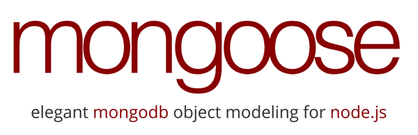

# Mongoose

[(Here for references)](http://mongoosejs.com/docs/index.html)

Mongoose provides a straight-forward, schema-based solution to model your application data. It includes built-in type casting, validation, query building, business logic hooks and more, out of the box.

### ***1º Install Mongoose***

First be sure you have [MongoDB](https://www.mongodb.com/download-center#community) and [Node.js](https://nodejs.org/en/) installed.

`$ npm install mongoose`

### ***2º Include mongoose***
The second thing we need to do is include mongoose in our project and 

`var mongoose = require('mongoose')`

### ***3º Connect with database***

open a connection to the test database on our locally running instance of MongoDB.

```
const dbUrl = 'mongodb://localhost:27017/test'

mongose.connect (dbUrl)
```


### ***4º Check the conection***

We have a pending connection to the test database running on localhost. We now need to get notified if we connect successfully or if a connection error occurs:

```
var db = mongoose.connection;
db.on('error', console.error.bind(console, 'connection error:'));
db.once('open', function() {
  // we're connected!
});
```

Once our connection opens, our callback will be called. (For brevity, let's assume that all following code is within this callback.)

### ***5º Create the Schema***

With Mongoose, everything is derived from a Schema. In this case we are working with this file ***Cat.js*** with one Schema with one property, name, which will be a String:

```
const mongoose = require('mongoose')
const Schema = mongoose.Schema

const CatSchema = new Schema({
    name: {
      type: String,
      required: true
    },
    age: Number
})

// Compiling our schema into a Model.
// We pass it into 'mongoose.model(modelName, schema)'

const Cat = mongoose.model('Cat', CatSchema )

module.exports = Cat
```


### ***6º Requiring the model***

`const Cat = require('./models/')Cat`


### ***7º Creating and saving a schema document***

```
/* Add a Cat */

  var kitty = new Cat({ name: 'Pepe' });

    kitty.save()
     .then( () => {
      console.log('cat saved properly!')
      mongoose.connection.close()
  })
  
  .catch( err => console.log(err) )
```


Kittens can meow, so let's take a look at how to add "speak" functionality to our documents:


### ***7º Adding and saving element to the MongoDB***

Each document can be saved to the database by calling its save method. The first argument to the callback will be an error if any occured.

```
var kitty = new Cat({ name: 'Zildjian' })

kitty.save(function (err) {
  if (err) {
    console.log(err)
  } else {
    console.log('meow')
  }
})
```


### ***8º Creating the promise***

When using mongoose, we just need to require it and point **mongoose.Promise** to it.

`mongoose.Promise = Promise`

### ***9º Listinf all elements from the data base***

```
Cat.find()
    .then( cats => {
      console.log(cats)
      mongoose.connection.close()
})
```

### ***10º Finding elements from the data base bby ID***

```
Cat.findById('592416128ebabc0c14f44278')
    .then( cats => {
      console.log(cats)
      mongoose.connection.close()
})
```

### ***11º Filtering cats by name***

```
  Cat.find({ name: 'Yoko'}, { _id: 0 })
    .then( cats => {
      console.log(cats)
      mongoose.connection.close()
    })
```


